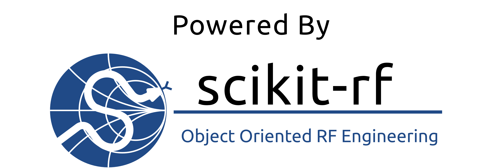

.. raw:: html

   

----------
About
----------

Motivation 
~~~~~~~~~~~

Measurements at microwave frequencies can require a significant amount post-processing and analysis, especially in research and prototyping environments. From our experience, none of the existing software products satisfy the needs of these environments, in which the abilities to understand, modify, and extend existing functionality are vital. In an attempt to provide this needed functionality, we have created scikit-rf, an open source, BSD-licensed package for microwave engineering implemented in the Python programming language. scikit-rf seeks to provides a modern, object-oriented library for network analysis and calibration aimed at being flexible and scalable.

Development History
~~~~~~~~~~~~~~~~~~~~

.. image:: _static/Thornton_Hall.JPG
    :align: right
    :height: 200

**scikit-rf** was created in 2009 by Alex Arsenovic while he was a graduate student at the University of Virginia's  millimeter wave research lab in 2009. It was originally called mwavepy, but was re-branded a scikit to emphasize its relationship to the scientific python community.  **scikit-rf** is licensed under the :doc:`BSD License <license>` and is currently being actively developed by a group of volunteers  `on Github <https://github.com/scikit-rf/scikit-rf/graphs/contributors>`_ . 

|
|

------------

Acknowledging or Citing scikit-rf
~~~~~~~~~~~~~~~~~~~~~~~~~~~~~~~~~~

In Publications
++++++++++++++++

If you use scikit-rf for work/research presented in a publication (whether directly, or as a dependency to another package), we ask that you ackowledge it. Perhaps with something like:

*This research made use of scikit-rf, an open-source Python package for RF and Microwave applications.*

You can also include a link to www.scikit-rf.org (if the journal allows this) in addition to the above text.

For academic citations, please cite the `IEEE Microwave Magazine article <https://ieeexplore.ieee.org/document/9632487>`_ that some of the community members wrote.
The IEEE-style citation for this paper is

  A. Arsenovic *et al.*, "scikit-rf: An Open Source Python Package for Microwave Network Creation, Analysis, and Calibration [Speaker’s Corner]," in *IEEE Microwave Magazine*, vol. 23, no. 1, pp. 98-105, Jan. 2022, doi: 10.1109/MMM.2021.3117139.

and in BibTex format

.. code-block:: latex

   @ARTICLE{9632487,
  author={Arsenovic, Alexander and Hillairet, Julien and Anderson, Jackson and Forstén, Henrik and Rieß, Vincent and Eller, Michael and Sauber, Noah and Weikle, Robert and Barnhart, William and Forstmayr, Franz},
  journal={IEEE Microwave Magazine}, 
  title={scikit-rf: An Open Source Python Package for Microwave Network Creation, Analysis, and Calibration [Speaker’s Corner]}, 
  year={2022},
  volume={23},
  number={1},
  pages={98-105},
  doi={10.1109/MMM.2021.3117139}}

In Presentations or Apps
+++++++++++++++++++++++++

If you are giving a presentation featuring work/research that makes use of scikit-rf or creating an app that  uses it under the hood, we provide this *powered by* image, 
( :download:`PNG <_static/powered_by_scikit-rf.png>` | :download:`SVG <_static/powered_by_scikit-rf.svg>` ).

------------

|
|
