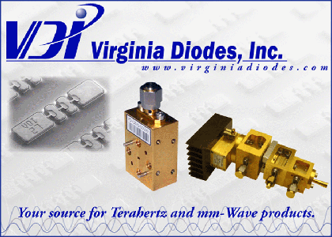

.. raw:: html

   

----------
About
----------

Development History
~~~~~~~~~~~~~~~~~~~~

.. image:: _static/Thornton_Hall.JPG
    :align: right
    :height: 200

**scikit-rf** was born in the `University of Virginia's <http://www.virginia.edu>`_ millimeter wave research lab in 2009, to provide functionality that was not available commercially. It was originally called mwavepy, but was re-branded a `scikit <http://www.scikits.appspot.com/>`_ to emphasize its relationship to the scientific python community.  **scikit-rf** is licensed under the :doc:`BSD License <license>` and is currently being developed by a group of volunteers  `on Github <https://github.com/scikit-rf/scikit-rf/graphs/contributors>`_ . 

Motivation 
~~~~~~~~~~~

As computer software continues to play an increasing role in the field of engineering design and analysis, it’s architecture becomes more important. To a degree, it is
the software’s design that determines which solutions are chosen. The more refined
and specialized the tool, the more pronounced it’s effect becomes. This can create a problem for research-type environments, which constantly require new and
innovative solutions. **scikit-rf** was consciously designed to provide essential functionality without imposing arbitrary limits or restrictions on its users. 

|
|

------------

Users
~~~~~~~~
|
|

.. image:: _static/dmpi.jpg
    :align: left
    
Dominion MicroProbes, Inc
+++++++++++++++++++++++++

    
http://dmprobes.com/ 
    
DMPI designs, manufactures and sells millimeter and sub-millimeter wavelength on-wafer ground-signal-ground probes and associated components for electrical measurement of devices and materials. We have developed a scalable approach for the manufacturing of phsyically robust micro machined probes with low-insertion loss coupling to the DUT and DC biasing of probed circuits. 

|
|
|

Virginia Diodes, Inc
+++++++++++++++++++++++++

    
http://vadiodes.com/ 
    
VDI manufactures state-of-the-art test and measurement equipment for mm-wave and THz applications.  These products include Vector Network Analyzer, Spectrum Analyzer and Signal Generator Extension Modules that extend the capability of high performance microwave measurement tools to higher frequencies.  VDI's component products include detectors, mixers, frequency multipliers and custom systems for reliable operation at frequencies between 50 GHz and 2 THz. All VDI components include in-house fabricated GaAs Schottky diodes and microelectronic filter structures. 

|
|
|
|

If your lab, company, or organization uses **scikit-rf** and would like to be listed please contact me at **arsenovic at virginia.edu**

|
|
