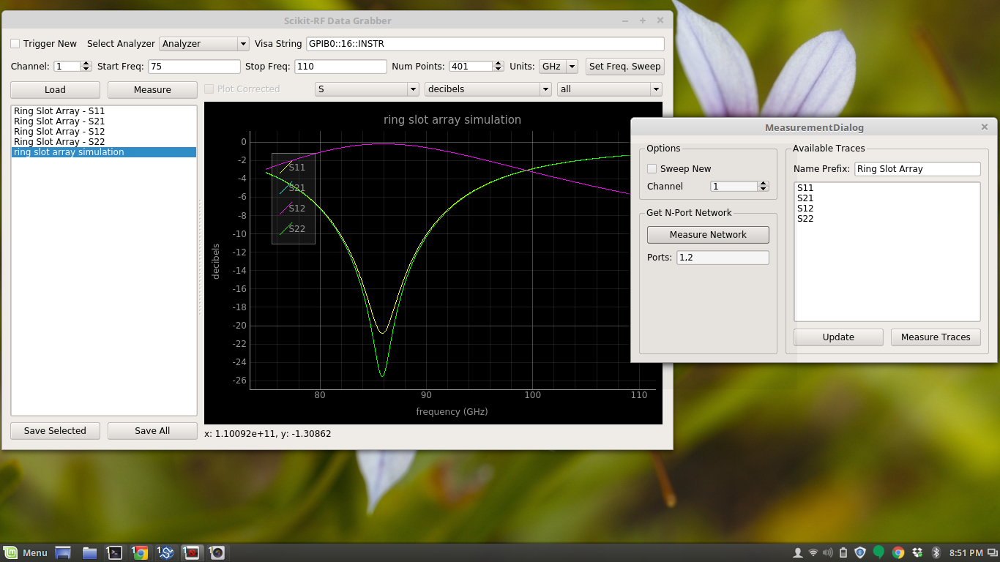
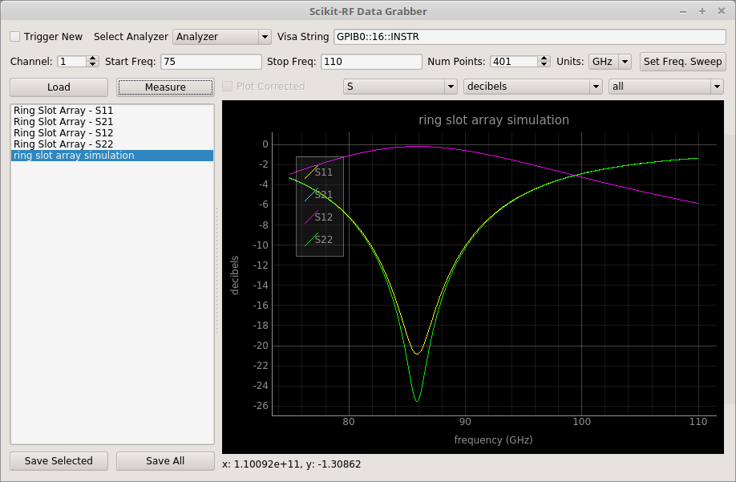
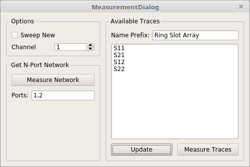

.. _qtapps:

-------------------------------
New qtapps module
-------------------------------

``qtapps`` are being created to provide **modular, re-useable apps** for data retrieval, plotting,  calibration and more. 

|

.. raw:: html

    

What... why?
~~~~~~~~~~~~~
|

There is a new folder in the scikit-rf repository called `qtapps <https://github.com/scikit-rf/scikit-rf/tree/master/qtapps>`_. It contains a python package called ``skrf_qtwidgets``.

The goal of this package is to provide a reusable set of qt widgets to easily construct gui applications that can measure, process, and analyze data. The two main widgets are a ``QListWidget`` called ``NetworkListWidget`` that provides a container for ``Network`` objects and a plot widget called ``NetworkPlotWidget`` for visualizing networks.

|
|

How
~~~
|

    
    
All of these feature are in the master git branch, so you will have to git it. 
There is a conda env called  ``skrf_qtapps_py35.yml`` in the qtapps module, which `can be used <http://conda.pydata.org/docs/using/envs.html#use-environment-from-file>`_ to run the qtapps. All currently constructed widgets are in the ``widgets.py`` and ``calibration_widgets.py`` modules.

Two example applications have been written:

- ``data_grabber.py`` is a simple data acquisition and viewer program.
- ``multiline_trl.py`` is a gui application that implements the ``MultilineTRL`` class, though I will probably switch this to the recently included NIST algorithm.

These are meant to be useful, but also conceptual. I would greatly appreciate testing, feedback and ideas for future applications. Documentation is basically non-existent right now, so please take a look at the working examples and code. I will put together something more helpful as I am able.

|
|

|
-- `vince <https://github.com/dvincentwest>`_

|
|

