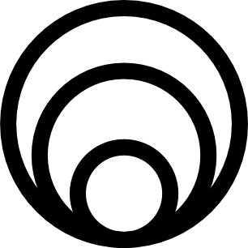
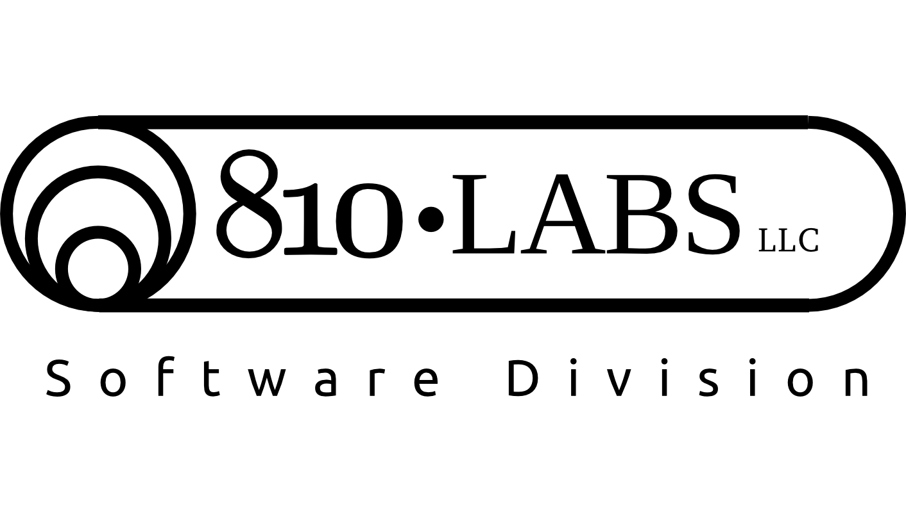

.. Consult 

**scikit-rf** Support 
--------------------------------

**scikit-rf** will always remain free and open-source. Period. For those who need 
help, there will always be public channels available:

 * `mailing list <http://groups.google.com/group/scikit-rf>`_
 * `slack <https://scikit-rf.slack.com>`_
 * `github <http://github.com/scikit-rf/scikit-rf>`_ 

For those who need private support and
development services, please see the following list of companies who support scikit-rf. 

.. raw:: html

    

810 Labs 
~~~~~~~~~~~~~~~

    

`810 Labs Software Division <http://www.810lab.com>`_  offers support services for scikit-rf. These 
services include:

 * Implementation of specific features in scikit-rf
 * One-on-one webinar tutorials and education
 * Private Development 
 * Technical Support 

|
|
|

If you would like to list your company here  please contact me at **alexanderarsenovic at gmail.com**

|
|
|
