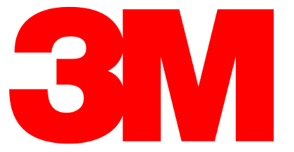
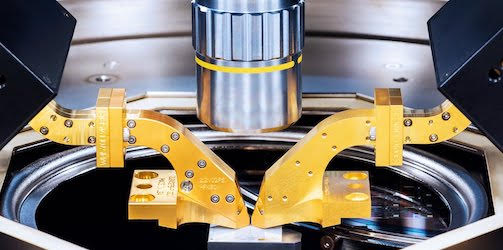

.. raw:: html

   

----------
Users
----------

Users
~~~~~~~~~~~~~~~~~~~~

Below is a list of  users of scikit-rf from industry and academia.

|
|

UVa Terahertz Lab
+++++++++++++++++++++++++

http://www.uvaterahertz.com/
    
UVa Terahertz Lab's mission is to create electronic devices capable of operating in the millimeter and sub-millimeter wave range. Our work includes high-frequency millimeter-wave power generation, low-noise receiver elements, integrated-circuit antennas and quasi-optical techniques.

|
|
|
|
|
|
|
|

    
3M Company
+++++++++++++++++++++++++

    
http://3m.com/ 
    
3M is a large manufacturing corporation.  Although it is well known for consumer products such as Scotch™ Tape and Post-It™ Notes, 3M has over 30000 products for areas such as Health Care, Electronics, Industrial, etc.  3M Uses scikit-rf for the automation of data collection and and sophisticated analysis and calibration routines not available in the on-board analyzer software to perform a variety of material property characterizations.

|
|
|

Virginia Diodes, Inc
+++++++++++++++++++++++++

http://vadiodes.com/ 
    
VDI manufactures state-of-the-art test and measurement equipment for mm-wave and THz applications.  These products include Vector Network Analyzer, Spectrum Analyzer and Signal Generator Extension Modules that extend the capability of high performance microwave measurement tools to higher frequencies.  VDI's component products include detectors, mixers, frequency multipliers and custom systems for reliable operation at frequencies between 50 GHz and 2 THz. All VDI components include in-house fabricated GaAs Schottky diodes and microelectronic filter structures. 

|
|
|
|

    
Dominion MicroProbes, Inc
+++++++++++++++++++++++++

    
http://dmprobes.com/ 
    
DMPI designs, manufactures and sells millimeter and sub-millimeter wavelength on-wafer ground-signal-ground probes and associated components for electrical measurement of devices and materials. DMPI has developed a scalable approach for the manufacturing of phsyically robust micro machined probes with low-insertion loss coupling to the DUT and DC biasing of probed circuits. 

|
|
|

Swissto12
+++++++++++++++++++++++++

http://www.swissto12.com/

SWISSto12 provides innovative passive components for mm-wave and THz
applications. SWISSto12’s products include corrugated waveguide
modules for low-loss signal transmission (available from 75 GHz up to
1 THz and beyond), 3D printed metal-coated plastic components and
solutions for material characterisation, on-wafer probing and gas
spectroscopy.

|
|
|
|
|

If your lab, company, or organization uses **scikit-rf** and would like to be listed please contact me at **alexanderarsenovic at gmail.com**

|
|
